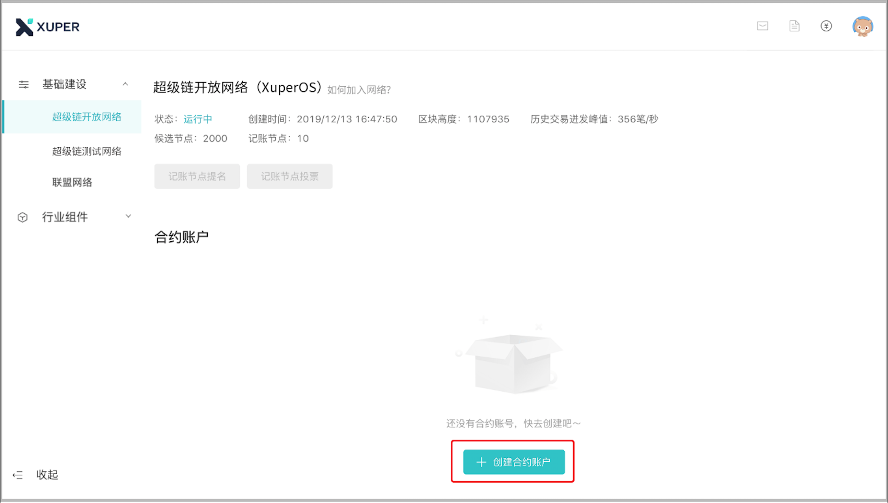
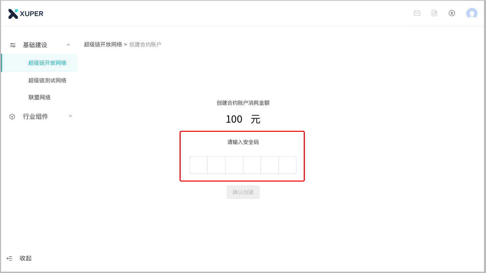
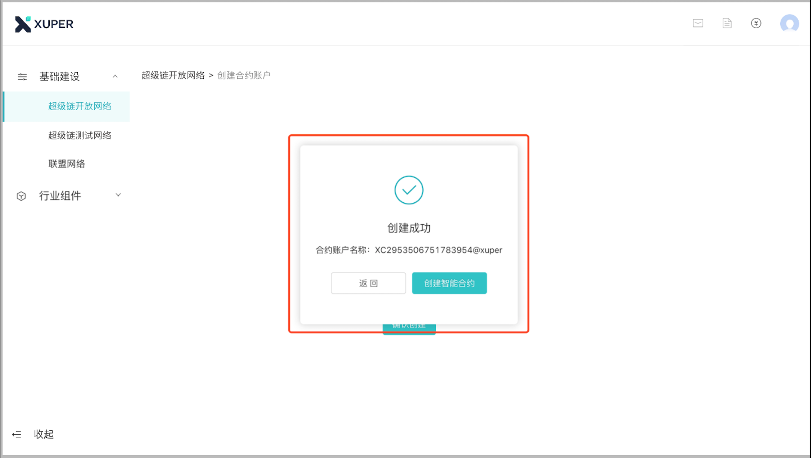
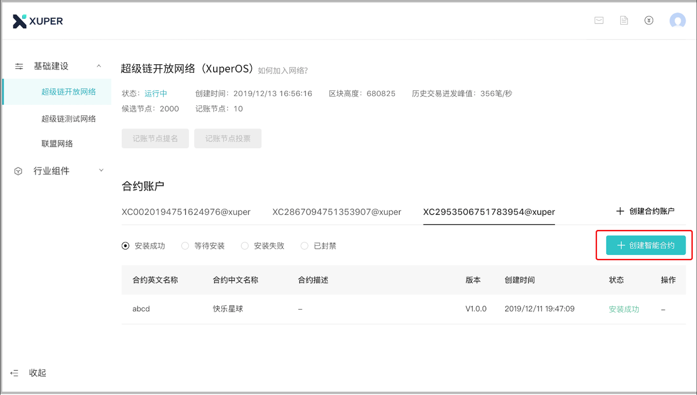
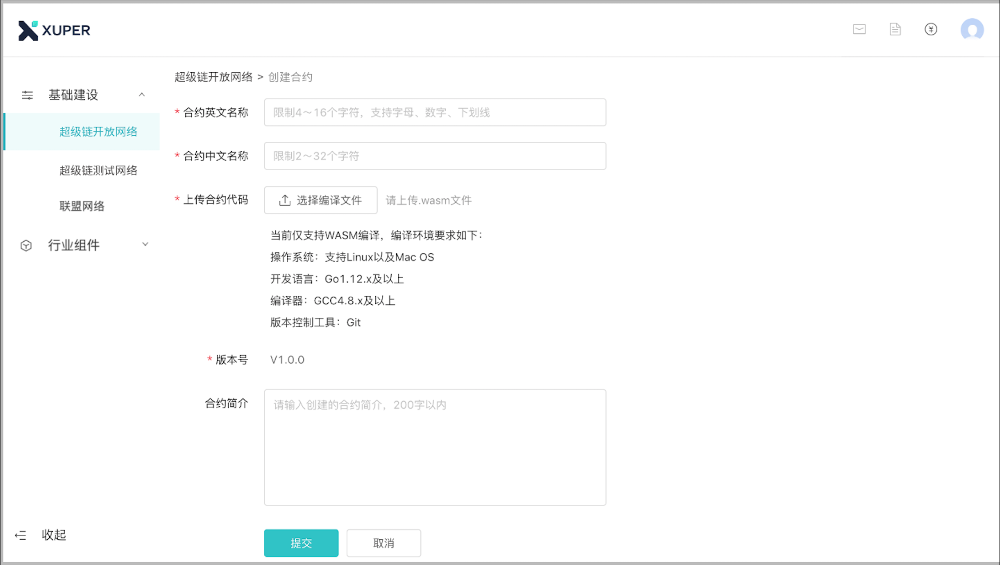
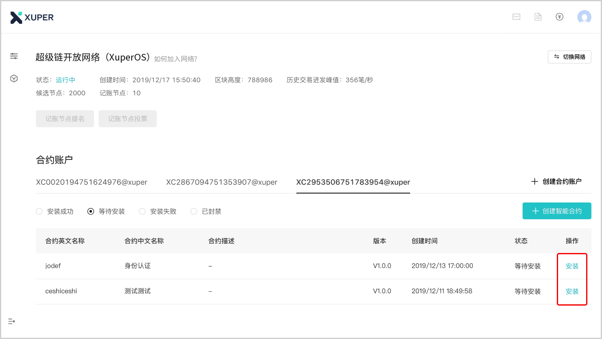
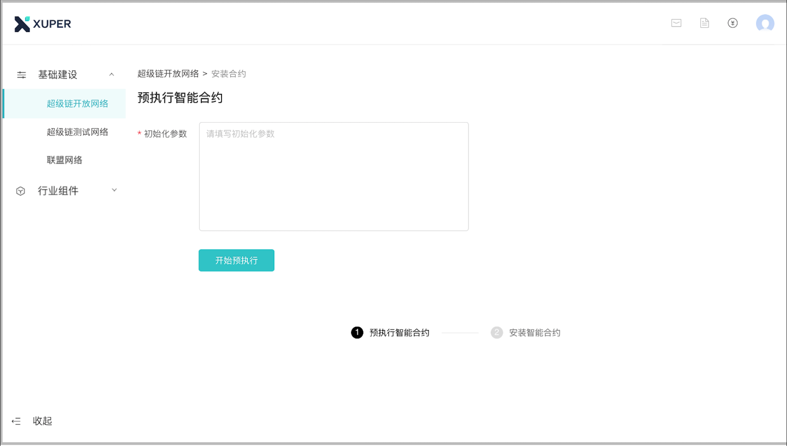
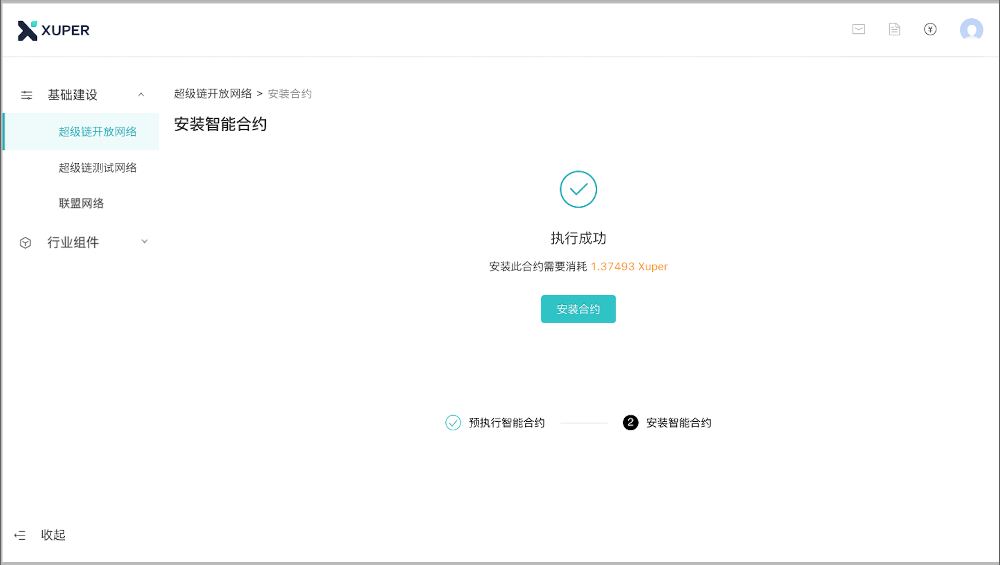
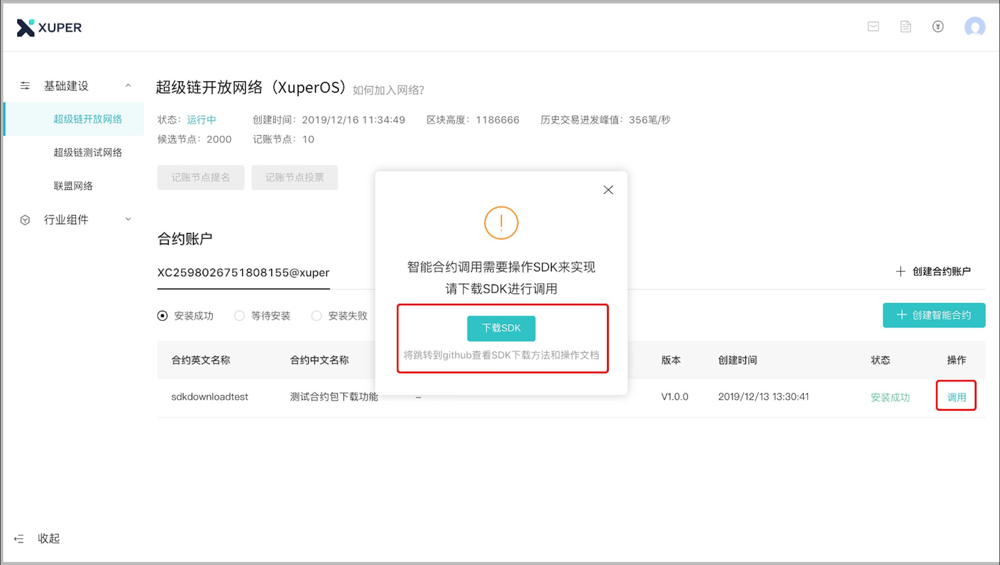

.. _manage:

创建/管理合约账户
-----------------

本节将向您介绍，如何创建、管理合约账户。创建账户后，可以查看、新增、安装、调用当前账户下的所有智能合约

1. 在控制台，选择「基础建设 —> 超级链开放网络」，点击「创建合约账户」 

2. 进入创建合约账户页，输入安全码后点击「确认创建」，系统自动生成账户名称后，即创建完毕

.. _create:

创建智能合约
------------

1.	在控制台，选择「基础建设 —> 超级链开放网络」，点击「创建智能合约」

2.	进入新页面，按要求填写、上传合约信息，填写完成后点击「提交」。合约代码编译请参考 `部署wasm合约 <https://xuperchain.readthedocs.io/zh/latest/advanced_usage/create_contracts.html#wasm>`_

3.	回到首页后，找到刚才已上传的智能合约，进行安装，点击「安装」

4.	进入安装合约页面，根据合约代码填写初始化参数，点击「开始预执行」。执行合约需要等待10S左右。

5.	执行成功后，页面显示安装合约预计消耗的Xuper值。点击「安装合约」将合约上链，上链过程需要等待10S左右。

6.	返回首页时，可看到合约状态变更为‘已安装’，即该合约已完成安装。若未看到合约状态变更，请刷新当前页面。

.. _invoke:

调用智能合约
------------

1. 在「安装成功」的列表中，找到要调用的目标合约，点击「调用」；
2.  按照弹框指引，可前往  `SDK使用说明与下载地址 <https://github.com/xuperchain/xuper-sdk-go/wiki/xuper-sdk-go-%E4%B8%AD%E6%96%87%E7%89%88>`_

