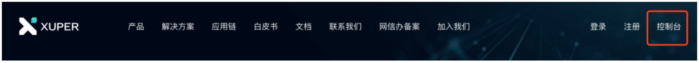
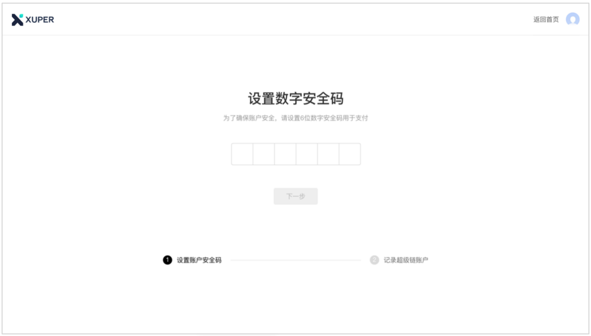
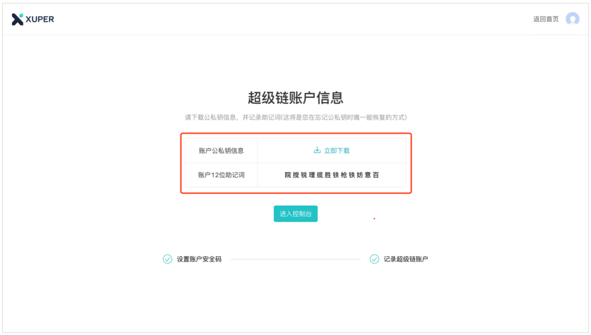
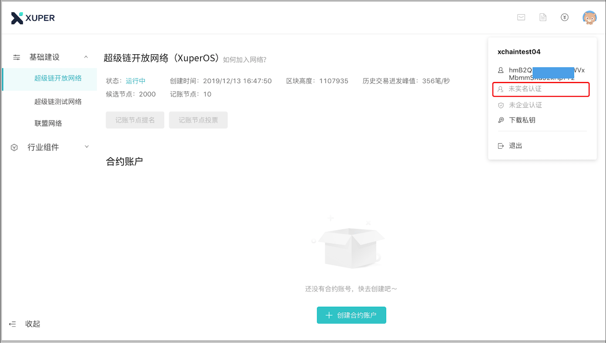
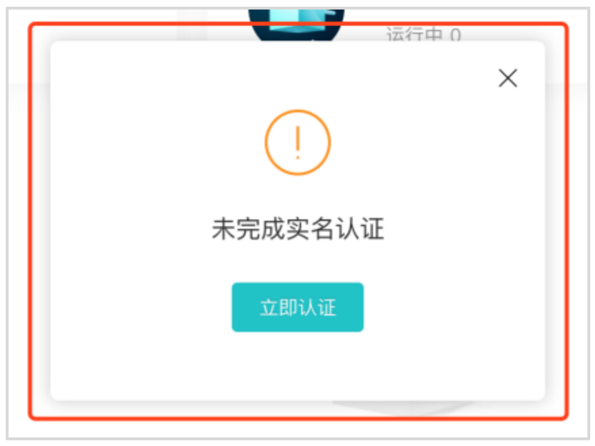
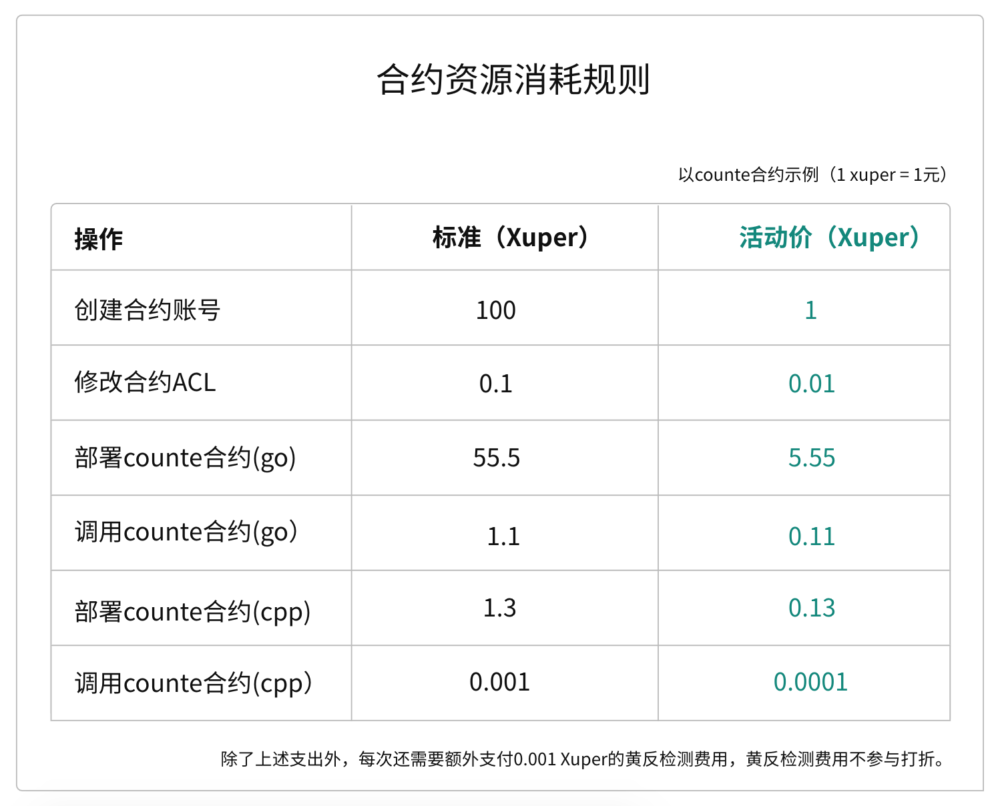
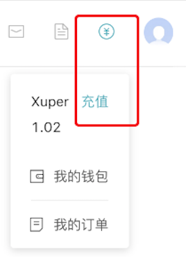

.. _register:

注册
----

1. 使用平台前，请先注册百度账号，若您已有百度账号，登录即可。
2. 点击右上角进入控制台

3. 进入设置账户安全码页，**安全码作为交易密码，请务必牢记**。平台无法提供安全码找回功能。设置完成后，点击「下一步」

4. 进入记录超级链账户页，请务必按照页面指引，下载账户私密钥、记下助记词，一旦遗失，会导致无法找回账户。平台无法提供找回私密钥、助记词功能。点击「进入控制台」，进入控制台页，即注册平台账号成功！

.. _auth:

认证
----

使用平台功能前，需完成实名认证。

认证步骤

**方式一**

1. 在控制台点击头像，选择「实名认证」，可跳到认证信息填写页。
2. 进入认证页面，按要求完成认证流程，认证立即生效

**方式二**

1. 在控制台相关实名认证弹框内，点击「立即认证」，可跳到认证信息填写页。
2. 进入认证页面，按要求完成认证流程，认证立即生效

.. _price:

计费规则
--------
本节主要介绍超级链开放网络-智能合约的计费规则

**计费说明**

1. 平台采用先充值后使用的计费方式
2. 平台使用统一的计费单位：Xuper（1Xuper=1元）
3. 每次付费、交易时，平台收取0.001Xuper的黄反检测费用

**计费规则**

以counte合约为例，展示资源消耗规则。（公测期间按活动价收费，活动结束后恢复标准价）

.. _recharge:

购买流程
--------

操作步骤：
1. 进入超级链控制台，点击个人中心->充值按钮，进入 `Xuper充值页 <https://xchain.baidu.com/n/console#/finance/wallet/recharge>`_

 
2. 进入充值页，输入充值金额，点击「确认充值」进行购买确认
3. 进入收银台，选择支付主体“个人账户”或“企业账户”，点击「确认支付」进行订单确认及并完成支付流程
4. 完成购买
